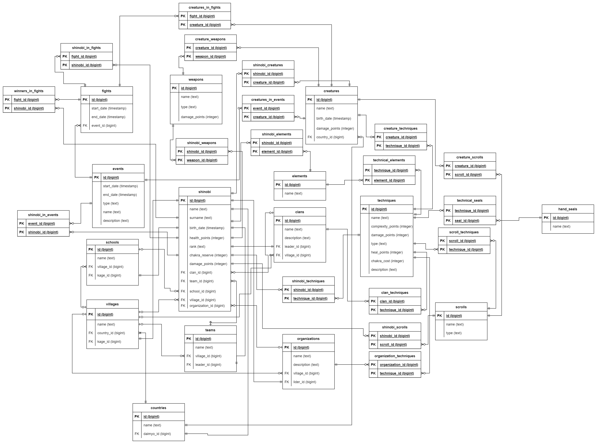

# Naruto Database
Database on the subject area of anime "Naruto".
## ER Diagram

## SQL scripts
* [Create database](schema.sql)
* [Drop database](drop.sql)
* [Triggers, functions, procedures](function.sql)
* [Indexes](index.sql)
